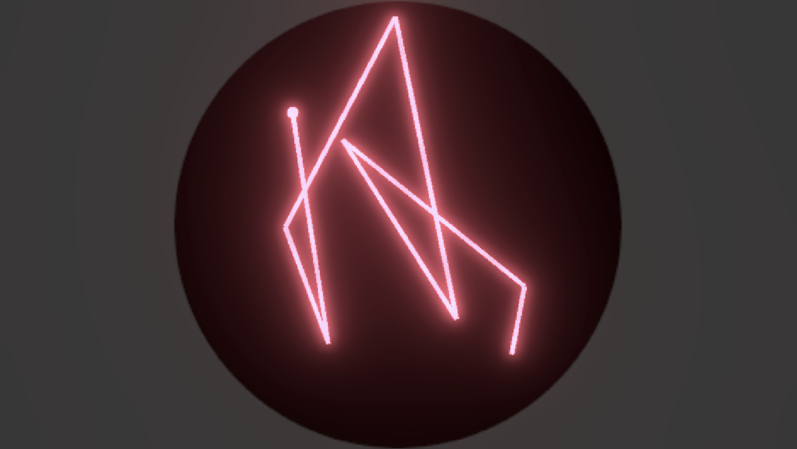

# Process Documentation

## 03.01.2025

Okay. Wow. So this went really fast. This project started as an experiment to make a simpler version of [Lest Ten Horizons Cry](http://www.mouseandthebillionaire.com/lthc) for the upcoming LUDODROME event at SAT in Montreal, but also an excuse to see how Cursor could speed up the design process. And it did. It's been a while since I've had this much fun making something. Getting Cursor (and claude underneath the hood) to take care of some of the tedious tasks is great. It ends up feeling more sketching out game ideas. Because it is hapenning so fast, I feel more open to the actual design-side of the project, similar to when I had RAs working with me on TIKATMOS.

The general idea is simple node-based etch-a-sketch style movement, where you're trying to locate hidden locations and lock them in. Once you do an additional node is ceated, which is linked by a line to the current node. After you set a certain number of nodes (8 in the current version) the nodes start to return to the center and you start again. You end up forming some sort of organic constallation of nodes, which feels somewhat interesting? Obviously once sound is in here, it will be more compelling, but I like the idea that you are generating (with the system) a piece of music that is unique each time. Currently it is set by the system (you trying to find the nodes) but it could also be user-directed?

### Next
- Build out the synth in Max MSP
- Import that into the project via RNBO
- Apply the sounds to the node control. This could be set (i.e first node is alway reverb, etc etc) Or maybe it's randomized each time?
- I like the idea of a directory of these saved sounds. Like you could load up the constellations that someone else has made from a menu on the right? But for now, I'll focud on the audio setup and see where it lands.

