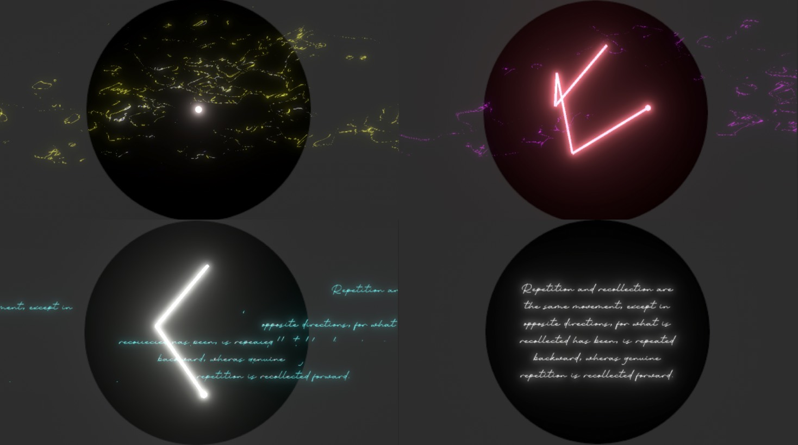

# Process Documentation

## 03.01.2025

Okay. Wow. So this went really fast. This project started as an experiment to make a simpler version of [Lest Ten Horizons Cry](http://www.mouseandthebillionaire.com/lthc) for the upcoming LUDODROME event at SAT in Montreal, but also an excuse to see how Cursor could speed up the design process. And it did. It's been a while since I've had this much fun making something. Getting Cursor (and claude underneath the hood) to take care of some of the tedious tasks is great. It ends up feeling more sketching out game ideas. Because it is happening so fast, I feel more open to the actual design-side of the project, similar to when I had RAs working with me on TIKATMOS.

The general idea is simple node-based etch-a-sketch style movement, where you're trying to locate hidden locations and lock them in. Once you do an additional node is created, which is linked by a line to the current node. After you set a certain number of nodes (8 in the current version) the nodes start to return to the center and you start again. You end up forming some sort of organic constallation of nodes, which feels somewhat interesting? Obviously once sound is in here, it will be more compelling, but I like the idea that you are generating (with the system) a piece of music that is unique each time. Currently it is set by the system (you trying to find the nodes) but it could also be user-directed?

### Next
- Build out the synth in Max MSP
- Import that into the project via RNBO
- Apply the sounds to the node control. This could be set (i.e first node is alway reverb, etc etc) Or maybe it's randomized each time?
- I like the idea of a directory of these saved sounds. Like you could load up the constellations that someone else has made from a menu on the right? But for now, I'll focus on the audio setup and see where it lands.

## 04.26.2025 / Busy Week!

Well, I haven't done anything on this for a while, but when I picked this back up this week I started in on more visual development, rather than doing _any_ sound-based stuff that I had claimed was next...

Partly this is because of a few breakthroughs in the concept. I like the idea of the node-discovery also uncovering some sort of visual element (leaning more into the puzzly parts of this), and after thinking about what this could be, I settled on written text. The question of "what text to use" always poses a problem. Generally, I'm not super excited about doing the writing myself, so I could ask someone else to contribute, but then I'm beholden to their timeline and output. So, finding some existing text is the easier way to go here. After some poking through my books I settled on Søren Kierkegaard's essay _Repetition_1.

Once this was settled, I reimplemented the [Limitless Glitch effects](https://assetstore.unity.com/packages/vfx/shaders/fullscreen-camera-effects/limitless-glitch-effects-148376?srsltid=AfmBOor-sppCFB5z007HNQx33WPLM5vBqByanMQqWdjI12ZStOuWoeTy) from LTHC, and now we're in business! There's an opportunity here to randomize the effects that are applied, but I think at first I will just have the user progress through effects as they find the nodes. Then, once all the nodes are found, the constellation will fade out, leaving the text for a given amount of time, before it collapses in on itself, becoming the starting node for the next "puzzle." And these just keep going and going. Repetition. Some users might walk away after working out one of these, but the hope would be that these function almost more like a labyrinth, where traversing the space in a semi-prescribed way leads to a contemplative state. Lofty goals!

In the next couple of days I want to think/write more on the repetitive nature of this (especially in relation to contemplative practices), but for now we'll leave it with some thoughts on next steps:

### Next
- Test building this whole experience out onto the Raspberry Pi. If I can learn how to better use the Pi as a deployement device, I feel like my life will be better...
- Sketch out and start building the case. I'm just going to use the existing LTCH one and chop it up, so shouldn't be too much to get this going.
- I generally think this is going to be better if I create the displayed text elements in Photoshop2. Partly this is so I can stylize them better, but also I want to experiment with splitting the whole thing up into five chunks that are _also_ being manipulated by the dials. I have the feeling that will look cool and feel good.
- And then, yes, I should really work on the audio...
  
## 05.04.25 / Text Content

* Repetition and recollection are the same movement, only in opposite directions; for what is recollected has been, is repeated backwards, whereas repetition properly so called is recollected forwards.
* For a cultured person, seeing a farce is similar to playing the lottery, except that one does not have the annoyance of winning money.
* One sits down upon a chair by the window, one looks out upon the great square, one sees the shadows of pedestrians hasten along the walls.
* Everything is transformed into a theatrical decoration. A dreamy reality looms up in the background of the soul.
* Midnight is past. One extinguishes the candles, one lights a small night lamp. The moonlight triumphs unalloyed. A single shadow appears still darker, a single footstep takes a long time to disappear.
* The cloudless vault of heaven seems sad and meditative, as though the end of the world were past and heaven undisturbed were concerned only with itself.
* One goes out again into the antechamber, into the vestibule, into that little cabinet, one goes to sleep - if one is of that fortunate number that can sleep.
* My discovery was of no importance, and yet it was a strange one, for I discovered that there is no such thing as repetition, and I had convinced myself of this by trying in every possible way to get it repeated.
* The older one grows and the more understanding of life one acquires, and taste for the agreeable and ability to relish it, in short, the more competent one becomes, the less one is content.
* By firmness of purpose and by dulling one's talent for observation one can attain a uniformity which has a far more anesthetizing effect than the most capricious diversions.
* Time becomes stronger and stronger, like a formula of incantation.
* I am adrift. Repetition is too transcendent for me also. I can circumnavigate myself, but I cannot erect myself above myself, I cannot find the Archimedean point.
* I am expecting a thunderstorm . . . and repetition. Yet - if only the thunderstorm were to come! 
* At the very thought I am joyful, indescribably blissful - even if my sentence were to be that no repetition is possible.
* I am again myself, here I have the repetition, I understand everything, and existence seems to me more beautiful than ever.
* It is over, my skiff is afloat, the next minute I am where my soul's yearning was, where the ideas foam with elemental rage, where thoughts arise boisterously like the nations in migration.
* There is a stillness like the profound silence of the South Sea, so that one can hear oneself speak even though the movement goes on in one's own interior - there where one every instant stakes one's life, every instant loses it, and wins it again.

## 05.10.25 | Repetition, Instauratio Exiguus

It dawned on me during the making/testing/thinking about this that repetition is a fundamental concept here. Partly this is just the nature of the game (or lack there of?). The player finds 5 nodes in succession with the sound pitch changing slighty to indicate the proper location. This search also aligns and uncovers text in the background. Once all 5 are found, the constellation is drawn to the center of the screen and the text is revealed. Then it fades out and we start again. Repeated forever; without change. I could have built a progression (in face the original idea was to have each constellation play a unique sonic fingerprint), but I think the concept is stronger as repetition. Ritual. Process. I am reminded of labyrinths, where the act of walking, of being in the moment, the process, the act, is the whole point. This stands in direct contrast with "games" where the point is to culminate in some final "win" state, but _not_ with play, where the point is to be in a state of play. 

After deciding on this theme, I then chose Søren Kierkegaard's essay ["Repetition"](https://archive.org/details/repetitionessayi0000kier_x5a6/page/n167/mode/2up) as the source for the on-screen texts. Initially this was just because duh, but there are some great lines here. This wasn't one of his essays I had read before, so it was nice to step back during the making/coding process and think through the idea through his lens. He has a totally different take on it which adds some complexity (and a bit of opaqueness) to the experience. Todo: read one or more of the many essays that discuss Kierkegaard's "Repetition" and write a more in-depth journal entry on the essay itself and how it related to the themes of this project

Lastly, I was unhappy with the anagram nae that I've been using for this, and wanted to find something more apt. I happened upon the word instauratio which is a latin phrase used in ancient Rome for the repetition  or redo of a religious rite. So when adding the modifier exiguus, we get "a small do-over" which I think is fitting.

## Notes

1. Which I've never even read, but the potential links to the repetitive nature of the work is too good to ignore. Hopefully I won't read it and immediately regret my choice
2. [Photopea](https://www.photopea.com) actually, because the University keeps taking away my Adobe credentials...

